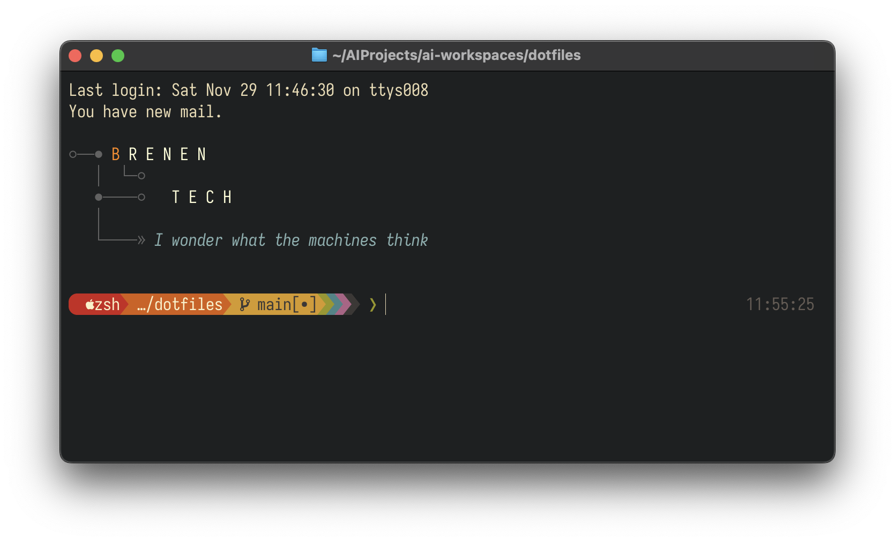

# Dotfiles

> A cross-platform terminal-first dotfiles repo: Ghostty + tmux on macOS, Foot + tmux on Linux, the same muscle memory on both. Modular installer, dry-run preview, conflict resolution, health checks, unified Gruvbox theming.

```bash
git clone git@github.com:BrennonTWilliams/dotfiles.git ~/.dotfiles
cd ~/.dotfiles
./install.sh --all
```


*Ghostty + Starship + tmux, Gruvbox throughout.*

---

## Why this repo

|                          | This repo                                                | Typical dotfiles      |
| ------------------------ | -------------------------------------------------------- | --------------------- |
| **Cross-platform**       | macOS + Linux, auto-detected                             | Usually single-OS     |
| **Installer**            | Modular, with `--preview` dry-run                        | Monolithic script     |
| **Conflict handling**    | Interactive prompts or `--auto-resolve`                  | Overwrites blindly    |
| **Post-install checks**  | `scripts/health-check.sh` validates everything           | None                  |
| **Terminal UX**          | Ghostty + tmux with curated keybindings, plugins, theme  | Ad-hoc                |
| **Recovery**             | Automatic timestamped backups with metadata              | Manual                |

---

## The Terminal Experience

macOS Ghostty and Linux Foot both drive a tmux session prefixed with `Ctrl+A`. Every `Cmd+*` Ghostty shortcut sends the equivalent tmux key sequence — your muscle memory works identically on both platforms. The result is a discoverable, fast, plugin-augmented terminal that feels less like a shell and more like an editor.

### Highlights

| Capability                       | Trigger                          | What you get                                                          |
| -------------------------------- | -------------------------------- | --------------------------------------------------------------------- |
| Project sessionizer              | `Cmd+Shift+T` or `prefix + T`    | fzf-pick any project dir, attach to existing tmux session or spawn one |
| Floating scratch terminal        | `prefix + g`                     | Throwaway shell overlay; doesn't disturb your layout                  |
| Floating lazygit                 | `Cmd+G` or `prefix + G`          | Git UI as a popup over any window                                     |
| Token / path picker (extrakto)   | `prefix + Tab`                   | fzf over visible pane text — grab URLs, paths, hashes, words          |
| Command-finish notifications     | `prefix + m`                     | macOS desktop notification when the monitored command completes       |
| Which-key popup                  | `prefix + ?`                     | Navigable list of every binding — discoverability built in            |
| nvim-aware pane navigation       | `Ctrl+h/j/k/l`                   | Seamless splits between tmux panes and nvim windows                   |
| Copy mode with system clipboard  | `prefix + [`, then `v` / `y`     | vi-style selection that lands in `pbcopy` / `wl-copy`                 |
| fzf session switcher             | `prefix + f`                     | Fuzzy-jump between active tmux sessions                               |
| btop system monitor              | `Cmd+M` or `prefix + M`          | Resource overlay without leaving your terminal                        |
| Command palette                  | `Cmd+Shift+P`                    | Ghostty's full action search                                          |
| Plugin management (TPM)          | `prefix + I` / `U` / `Alt+U`     | Install, update, prune tmux plugins in place                          |

The Gruvbox theme runs the full stack — terminal, Starship prompt, tmux status bar, Neovim, git delta. `toggle-theme` flips everything light/dark in one shot, with auto-detection on macOS.

→ **Full keybinding reference:** [docs/CHEATSHEET.md](docs/CHEATSHEET.md)

---

## Installation

### Prerequisites

**macOS** — install Homebrew, then add it to your PATH:
```bash
/bin/bash -c "$(curl -fsSL https://raw.githubusercontent.com/Homebrew/install/HEAD/install.sh)"
echo 'eval "$(/opt/homebrew/bin/brew shellenv)"' >> ~/.zprofile
eval "$(/opt/homebrew/bin/brew shellenv)"
```

**Linux (Ubuntu/Debian):**
```bash
sudo apt update && sudo apt install -y git curl stow
```

### Install modes

```bash
./install.sh                      # Interactive — pick components
./install.sh --all                # Everything, non-interactive
./install.sh --packages           # System packages only
./install.sh --terminal           # Terminal + shell only
./install.sh --dotfiles           # Symlinks only (packages assumed)
./install.sh --check-deps         # Verify deps without installing
```

### Preview before installing

```bash
./install.sh --preview --all      # Show what would change
./install.sh --preview --dotfiles # Preview symlink creation
```

### Conflict resolution

```bash
./install.sh --dotfiles                              # Prompt on conflict (default)
./install.sh --dotfiles --auto-resolve=overwrite     # Backup + replace
./install.sh --dotfiles --auto-resolve=keep-existing # Keep your files
```

Detailed install walkthroughs: [docs/GETTING_STARTED.md](docs/GETTING_STARTED.md) · [docs/INSTALLATION_OPTIONS.md](docs/INSTALLATION_OPTIONS.md)

---

## First steps after install

```bash
# 1. Reload your shell
exec zsh

# 2. Set git identity
git config --global user.name  "Your Name"
git config --global user.email "your.email@example.com"

# 3. Validate the install
./scripts/health-check.sh
```

The template `git/.gitconfig` ships with placeholder values; your real identity lives in `~/.gitconfig.local` (gitignored, machine-specific).

---

## Machine-specific overrides

Every `*.local` file below is gitignored and sourced at the right point in the startup chain:

| File                  | Sourced from        | Use for                                              |
| --------------------- | ------------------- | ---------------------------------------------------- |
| `~/.zshrc.local`      | end of `.zshrc`     | Custom paths, aliases, API keys for CLI wrappers     |
| `~/.zshenv.local`     | `.zshenv`           | Env vars (e.g. `DOTFILES_ABBR_MODE=alias`)           |
| `~/.zprofile.local`   | `.zprofile`         | Login-shell-only setup                               |
| `~/.gitconfig.local`  | `git/.gitconfig`    | `[user]` block, `[github]` user, work overrides     |
| `~/.tmux.local`       | `.tmux.conf`        | Per-machine tmux tweaks (`set -g mouse on`, etc.)    |

---

## What's inside

Each top-level directory is a GNU Stow package symlinked into `$HOME`:

- **Shell** — `zsh/`, `bash/` with cross-platform utilities and optional zsh-abbr abbreviations
- **Terminal** — `ghostty/` (macOS), `foot/` (Linux), `tmux/` with curated plugin set
- **Editor** — `neovim/`, plus VS Code extension management
- **Prompt & WM** — `starship/` (three display modes), `sway/` (Linux tiling WM)
- **Dev tooling** — `git/` with delta, NPM globals, conda lazy-load
- **Scripts** — `scripts/install.sh`, modular setup scripts, shared `scripts/lib/`

Full symlink map: [docs/SYMLINK_REFERENCE.md](docs/SYMLINK_REFERENCE.md)

---

## Updating

```bash
cd ~/.dotfiles
git pull
stow --restow bash foot ghostty git neovim npm starship sway tmux vscode zsh
./scripts/health-check.sh
```

See [docs/MAINTENANCE_GUIDE.md](docs/MAINTENANCE_GUIDE.md) for upgrade workflows and [docs/BACKUP_RECOVERY.md](docs/BACKUP_RECOVERY.md) for restore procedures.

Hit a snag? [TROUBLESHOOTING.md](TROUBLESHOOTING.md) covers common install, stow, and shell issues.

---

## Documentation

### Setup & install
- [Getting Started](docs/GETTING_STARTED.md) — platform-specific walkthrough
- [Installation Options](docs/INSTALLATION_OPTIONS.md) — every flag, every mode
- [System Requirements](docs/SYSTEM_REQUIREMENTS.md) — versions and packages
- [macOS Setup](docs/MACOS_SETUP.md) · [System Setup](docs/SYSTEM_SETUP.md)

### Daily use
- [Ghostty + tmux Cheatsheet](docs/CHEATSHEET.md) — full keybinding reference
- [Usage Guide](docs/USAGE_GUIDE.md) — Starship, theming, abbreviations, uniclip, daily workflow
- [Features](docs/FEATURES.md) — theme, performance, dev environment details
- [Starship Configuration](docs/STARSHIP_CONFIGURATION.md) — prompt modes and customization

### Platform & cross-platform
- [Cross-Platform Utilities](docs/CROSS_PLATFORM_UTILITIES.md) — path resolution, detection
- [Platform Comparison](docs/PLATFORM_COMPARISON.md) · [Package Management](docs/PACKAGE_MANAGEMENT.md)
- [Symlink Reference](docs/SYMLINK_REFERENCE.md)

### Ghostty deep-dives
- [Ghostty Finder Integration](docs/GHOSTTY_FINDER_INTEGRATION.md)
- [Ghostty Troubleshooting](docs/GHOSTTY_TROUBLESHOOTING.md)
- [Ghostty Statusline](docs/ghostty-statusline.md)
- [WezTerm → Ghostty Migration](docs/WEZTERM_TO_GHOSTTY_MIGRATION.md)

### Maintenance
- [Maintenance Guide](docs/MAINTENANCE_GUIDE.md) · [Backup & Recovery](docs/BACKUP_RECOVERY.md)
- [Health Check System](docs/HEALTH_CHECK_SYSTEM.md) · [Troubleshooting](TROUBLESHOOTING.md)

### Development
- [Testing](docs/TESTING.md) · [Shellcheck](docs/SHELLCHECK.md) · [Style Guide](docs/STYLE-GUIDE.md)
- [Contributing](CONTRIBUTING.md) · [Changelog](CHANGELOG.md)

### Legal
- [License (MIT)](LICENSE.md) · [Third-Party Licenses](docs/THIRD-PARTY-LICENSES.md)
- [Code of Conduct](CODE_OF_CONDUCT.md) · [Security Policy](SECURITY.md)

---

## Contributing

Contributions welcome. Read [CONTRIBUTING.md](CONTRIBUTING.md), fork, branch, run `./scripts/health-check.sh` and `tests/run_all_tests.sh`, open a PR. Issue and PR templates live in [.github/](.github/).

---

## License

MIT — see [LICENSE.md](LICENSE.md). Third-party tools and their licenses: [docs/THIRD-PARTY-LICENSES.md](docs/THIRD-PARTY-LICENSES.md).

---

## Acknowledgments

[Gruvbox](https://github.com/morhetz/gruvbox) · [Starship](https://starship.rs/) · [GNU Stow](https://www.gnu.org/software/stow/) · [Ghostty](https://mitchellh.com/ghostty) · [Foot](https://codeberg.org/dnkl/foot) · [tmux](https://github.com/tmux/tmux) · the maintainers of every plugin in `tmux/.tmux.conf`.
