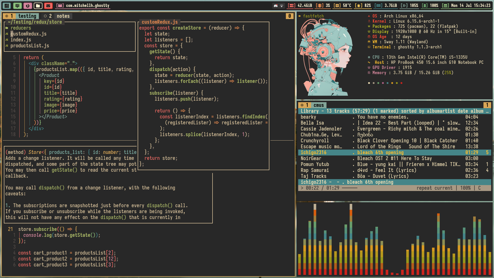

# Public Release Action Plan - Dotfiles Repository
**Created:** 2025-11-15
**Overall Score:** 71/100 (Good - Ready with Improvements)
**Target Score:** 90/100
**Time to Release-Ready:** 1-2 days

---

## Quick Summary

Your dotfiles repository has **excellent technical foundations** (code quality 82/100, configuration management 87/100) but needs work in three areas:

1. **Personal information cleanup** - Hardcoded paths will break for other users
2. **Community infrastructure** - Missing standard GitHub files
3. **User experience** - No screenshots, overwhelming README

**Good news:** All issues are fixable in 1-2 days of focused work.

---

## Priority 1: CRITICAL BLOCKERS (Must Fix Before Release)

### Estimated Time: 4-6 hours

#### A. Personal Information Cleanup (2-3 hours)

**Status:** ⚠️ **BLOCKS PUBLIC RELEASE**

| File | Line | Issue | Fix | Time |
|------|------|-------|-----|------|
| `macos/com.uniclip.plist` | 27 | Hardcoded `/Users/brennon` | Change to `~` or `$HOME` | 5 min |
| `tests/quick_package_validation.sh` | 6 | Absolute path to personal project | Use relative path `../scripts/lib/utils.sh` | 5 min |
| `zsh/.zsh_cross_platform` | 146-189 | Personal project directory mappings | Remove or move to `.zshrc.local` example | 30 min |
| `zsh/.zshrc` | Multiple | Personal project PATH additions | Remove hardcoded fallbacks | 30 min |
| README.md, CONTRIBUTING.md, etc. | Multiple | `BrennonTWilliams` username | Update to actual public URL or placeholder | 1 hour |

**Action Items:**
```bash
# 1. Fix LaunchAgent plist
# In macos/com.uniclip.plist, change:
<string>/Users/brennon</string>
# To:
<string>~</string>

# 2. Fix test script
# In tests/quick_package_validation.sh, change:
UTILS_FILE="/Users/brennon/AIProjects/ai-workspaces/dotfiles/scripts/lib/utils.sh"
# To:
UTILS_FILE="$(dirname "$0")/../scripts/lib/utils.sh"

# 3. Clean personal project paths
# In zsh/.zsh_cross_platform, remove lines 146-189
# Or move to a .zshrc.local.example template file

# 4. Clean .zshrc personal paths
# Remove or comment out lines with:
# - $HOME/AIProjects/ai-workspaces/uzi
# - $HOME/AIProjects/ai-workspaces/sdd-workshops
# - video-analysis-cli references

# 5. Update GitHub username
# Global find/replace in documentation:
# BrennonTWilliams → yourusername (or actual public username)
```

**Verification:**
```bash
# Test on fresh system without personal directories
# Should complete successfully without errors
./install-new.sh --all
```

---

#### B. GitHub Community Standards (2-3 hours)

**Status:** ⚠️ **REQUIRED FOR PROFESSIONAL PROJECT**

##### B1. CODE_OF_CONDUCT.md (10 minutes)

**Why:** GitHub community standard, shows project is welcoming

**Action:**
```bash
# Download Contributor Covenant 2.1
curl -o CODE_OF_CONDUCT.md \
  https://www.contributor-covenant.org/version/2/1/code_of_conduct/code_of_conduct.md

# Edit contact email
# Replace [INSERT CONTACT METHOD] with your preferred contact
```

**Template:**
```markdown
# Contributor Covenant Code of Conduct

## Our Pledge
We as members, contributors, and leaders pledge to make participation in our
community a harassment-free experience for everyone...

[Full Contributor Covenant text]

## Enforcement
Instances of abusive, harassing, or otherwise unacceptable behavior may be
reported to the community leaders responsible for enforcement at
[your-email@example.com].
```

---

##### B2. Issue Templates (30 minutes)

**Why:** Standardizes bug reports and feature requests, reduces triage time

**Action:**
```bash
mkdir -p .github/ISSUE_TEMPLATE
```

**Create `.github/ISSUE_TEMPLATE/bug_report.md`:**
```yaml
---
name: Bug Report
about: Report a bug or issue with the dotfiles
title: '[BUG] '
labels: bug
assignees: ''
---

## Bug Description
A clear description of the bug.

## Steps to Reproduce
1. Run command '...'
2. See error '...'

## Expected Behavior
What should have happened?

## Actual Behavior
What actually happened?

## Environment
- OS: [macOS 14.5 / Ubuntu 22.04 / etc.]
- Architecture: [Intel x86_64 / Apple Silicon ARM64]
- Shell: [zsh 5.9 / bash 5.1]
- Installation method: [install.sh / install-new.sh]

## Additional Context
Any other relevant information, logs, or screenshots.
```

**Create `.github/ISSUE_TEMPLATE/feature_request.md`:**
```yaml
---
name: Feature Request
about: Suggest a new feature or enhancement
title: '[FEATURE] '
labels: enhancement
assignees: ''
---

## Feature Description
Clear description of the proposed feature.

## Use Case
Why is this feature needed? What problem does it solve?

## Proposed Solution
How should this feature work?

## Alternatives Considered
What other approaches have you thought about?

## Additional Context
Any mockups, examples, or references.
```

**Create `.github/ISSUE_TEMPLATE/config.yml`:**
```yaml
blank_issues_enabled: false
contact_links:
  - name: Documentation
    url: https://github.com/yourusername/dotfiles/blob/main/README.md
    about: Please check the documentation first
  - name: Discussions
    url: https://github.com/yourusername/dotfiles/discussions
    about: Ask questions and discuss ideas
```

---

##### B3. Pull Request Template (15 minutes)

**Why:** Ensures consistent PR descriptions and checklist compliance

**Create `.github/pull_request_template.md`:**
```markdown
## Description
Brief description of changes.

## Type of Change
- [ ] Bug fix (non-breaking change fixing an issue)
- [ ] New feature (non-breaking change adding functionality)
- [ ] Breaking change (fix or feature causing existing functionality to change)
- [ ] Documentation update
- [ ] Configuration change

## Testing
- [ ] Tested on macOS (Intel / Apple Silicon)
- [ ] Tested on Linux (distribution: _______)
- [ ] All existing tests pass (`./tests/run_all_tests.sh`)
- [ ] Added new tests for new functionality
- [ ] Ran health check (`./scripts/health-check.sh`)

## Checklist
- [ ] Code follows project style guidelines
- [ ] Self-reviewed code and comments
- [ ] Updated documentation (README, CHANGELOG, etc.)
- [ ] No new warnings introduced
- [ ] Added tests that prove fix is effective or feature works
- [ ] New and existing tests pass locally
- [ ] Dependent changes have been merged

## Screenshots (if applicable)
Add screenshots showing the changes.

## Additional Notes
Any additional information for reviewers.
```

---

##### B4. SECURITY.md (20 minutes)

**Why:** Clear process for reporting vulnerabilities, GitHub security standard

**Create `SECURITY.md`:**
```markdown
# Security Policy

## Supported Versions

We release patches for security vulnerabilities for the following versions:

| Version | Supported          |
| ------- | ------------------ |
| 1.x     | :white_check_mark: |
| < 1.0   | :x:                |

## Reporting a Vulnerability

**Please do not report security vulnerabilities through public GitHub issues.**

Instead, please report them via email to [your-email@example.com].

You should receive a response within 48 hours. If for some reason you do not, please follow up via email to ensure we received your original message.

Please include the following information:
- Type of issue (e.g., buffer overflow, SQL injection, cross-site scripting, etc.)
- Full paths of source file(s) related to the issue
- Location of the affected source code (tag/branch/commit or direct URL)
- Step-by-step instructions to reproduce the issue
- Proof-of-concept or exploit code (if possible)
- Impact of the issue, including how an attacker might exploit it

## What to Expect

- Acknowledgment of your report within 48 hours
- Regular updates on our progress (at least every 5 business days)
- Notification when the issue is fixed
- Credit in the release notes (unless you prefer to remain anonymous)

## Security Best Practices

When using these dotfiles:

1. **Never commit sensitive data**
   - Use `*.local` files for personal information
   - Keep credentials in `.env` files (gitignored)
   - Review `.gitignore` before committing

2. **Review scripts before execution**
   - Especially scripts downloaded from the internet
   - Check setup-*.sh scripts for unexpected behavior

3. **Use SSH keys properly**
   - Never commit private keys
   - Use SSH agent for key management

4. **Keep dependencies updated**
   - Regularly update packages: `brew upgrade`, `apt update && apt upgrade`
   - Monitor security advisories for installed tools

## Scope

This security policy applies to:
- Installation scripts
- Configuration files
- Shell scripts and utilities
- Documentation examples

Out of scope:
- Third-party tools installed by these dotfiles
- Operating system vulnerabilities
- Hardware issues
```

---

##### B5. THIRD-PARTY-LICENSES.md (1-2 hours)

**Why:** Proper attribution for third-party code, legal compliance

**Create `THIRD-PARTY-LICENSES.md`:**
```markdown
# Third-Party Licenses and Attributions

This project includes or references code from the following third-party sources:

---

## Code Included in Repository

### Gruvbox ZSH Theme
- **Based on:** agnoster's ZSH Theme
- **Source:** https://gist.github.com/agnoster/3712874
- **Modified by:** Brennon Williams
- **Changes:** Adapted for Gruvbox color scheme, added Nerd Font support
- **License:** MIT (assumed from ZSH theme ecosystem)

### Starship Prompt Configuration
- **Based on:** Gruvbox-Rainbow Preset
- **Source:** https://starship.rs/presets/gruvbox-rainbow
- **License:** ISC (Starship project)
- **Changes:** Custom module configuration, added verbose/compact modes

---

## External Dependencies Installed via Scripts

### Shell and Terminal

#### Oh My Zsh
- **Project:** https://github.com/ohmyzsh/ohmyzsh
- **License:** MIT
- **Usage:** Installed via `scripts/setup-ohmyzsh.sh`

#### Zsh Autosuggestions
- **Project:** https://github.com/zsh-users/zsh-autosuggestions
- **License:** MIT
- **Usage:** Installed as Oh My Zsh plugin

#### Zsh Syntax Highlighting
- **Project:** https://github.com/zsh-users/zsh-syntax-highlighting
- **License:** BSD-3-Clause
- **Usage:** Installed as Oh My Zsh plugin

### Tmux Plugins

#### Tmux Plugin Manager (TPM)
- **Project:** https://github.com/tmux-plugins/tpm
- **License:** MIT
- **Usage:** Plugin manager for tmux

#### tmux-sensible
- **Project:** https://github.com/tmux-plugins/tmux-sensible
- **License:** MIT
- **Usage:** Basic tmux settings everyone can agree on

#### tmux-yank
- **Project:** https://github.com/tmux-plugins/tmux-yank
- **License:** MIT
- **Usage:** Copy to system clipboard

#### tmux-resurrect
- **Project:** https://github.com/tmux-plugins/tmux-resurrect
- **License:** MIT
- **Usage:** Persist tmux environment across system restarts

#### tmux-continuum
- **Project:** https://github.com/tmux-plugins/tmux-continuum
- **License:** MIT
- **Usage:** Continuous saving of tmux environment

#### tmux-cpu
- **Project:** https://github.com/tmux-plugins/tmux-cpu
- **License:** MIT
- **Usage:** Display CPU and memory usage in status bar

#### tmux-battery
- **Project:** https://github.com/tmux-plugins/tmux-battery
- **License:** MIT
- **Usage:** Display battery status in status bar

### Prompt and Tools

#### Starship
- **Project:** https://starship.rs/
- **License:** ISC
- **Usage:** Cross-shell prompt

#### Uniclip
- **Project:** https://github.com/elves/uniclip
- **License:** BSD-2-Clause
- **Usage:** Universal clipboard sharing (macOS)

---

## Gruvbox Color Scheme

The Gruvbox color scheme used throughout is originally created by:
- **Author:** Pavel Pertsev (morhetz)
- **Project:** https://github.com/morhetz/gruvbox
- **License:** MIT

This repository uses Gruvbox Dark Hard variant across:
- Terminal emulators (Ghostty, Foot)
- Tmux status bar
- VS Code editor
- Starship prompt
- ZSH theme

---

## Nerd Fonts

This repository recommends and is optimized for Nerd Fonts:
- **Project:** https://www.nerdfonts.com/
- **License:** Various (per-font licenses, typically SIL OFL)
- **Usage:** Icon support in prompt and terminal

Recommended fonts:
- FiraCode Nerd Font
- Hack Nerd Font
- JetBrainsMono Nerd Font

---

## License Compatibility

All third-party dependencies use permissive licenses compatible with MIT:
- MIT License
- BSD-2-Clause and BSD-3-Clause
- ISC License

No GPL or AGPL dependencies are included.

---

## Acknowledgments

This dotfiles repository was inspired by:
- [GNU Stow documentation](https://www.gnu.org/software/stow/)
- [mathiasbynens/dotfiles](https://github.com/mathiasbynens/dotfiles)
- [thoughtbot/dotfiles](https://github.com/thoughtbot/dotfiles)

---

## Updating This File

When adding new third-party dependencies:
1. Add entry with project name, URL, and license
2. Ensure license compatibility (permissive licenses only)
3. Update main README.md credits section
4. Verify attribution is present in code comments where applicable

---

**Last Updated:** 2025-11-15
**Dotfiles Version:** 1.0.0
```

---

## Priority 2: USER EXPERIENCE (High Impact)

### Estimated Time: 4-5 hours

#### C. README Improvements (2-3 hours)

**Current:** 1,332 lines, no screenshots, overwhelming
**Target:** 300-400 lines with visuals, details in separate docs

##### C1. Add Hero Screenshot (5 minutes)

**Action:**
```markdown
# Add after title and badges in README.md

> 🎨 Beautiful cross-platform development environment with Gruvbox theme
>
> Native support for macOS (Apple Silicon + Intel) and Linux (5+ distros)


*Gruvbox-themed terminal with Starship prompt, Sway, and modern development tools*
```

##### C2. Create TL;DR Section (15 minutes)

**Action:**
```markdown
## ⚡ TL;DR

**Get a beautiful terminal in 5 minutes:**

\`\`\`bash
git clone git@github.com:yourusername/dotfiles.git ~/.dotfiles
cd ~/.dotfiles && ./install-new.sh --all
exec zsh  # Reload shell
\`\`\`

**You get:**
- 🎨 **Unified Gruvbox theme** across all tools
- 🚀 **Starship prompt** with Nerd Font icons
- 🖥️ **Cross-platform** - macOS (Intel + Apple Silicon) and Linux
- ⚡ **Health checks** validate everything works
- 🔒 **Secure templates** - no hardcoded credentials
- 📦 **500+ configs** managed automatically

**Time to install:** 10-20 minutes on Linux, 15-25 on macOS
```

##### C3. Add "Why This Dotfiles?" Section (30 minutes)

**Action:**
```markdown
## 🎯 Why This Dotfiles?

| Feature | This Repo | mathiasbynens | thoughtbot | holman |
|---------|:---------:|:-------------:|:----------:|:------:|
| **Cross-Platform** | ✅ macOS + Linux | ⚠️ macOS only | ⚠️ Limited | ⚠️ macOS only |
| **Apple Silicon** | ✅ Native ARM64 | ✅ | ⚠️ Partial | ⚠️ Partial |
| **Health Checks** | ✅ 90+ checks | ❌ | ❌ | ❌ |
| **Modular Install** | ✅ Pick & choose | ❌ All or nothing | ⚠️ Limited | ✅ |
| **Testing** | ✅ 33 tests | ⚠️ Basic | ✅ Good | ⚠️ Limited |
| **Security** | ✅ Template system | ⚠️ Manual | ✅ Good | ⚠️ Manual |
| **Active (2024+)** | ✅ | ⚠️ 2023 | ✅ | ❌ 2017 |

**Perfect for:**
- 👨‍💻 Developers managing multiple machines (work + personal + servers)
- 👥 Teams standardizing development environments
- 🍎 Apple Silicon users (native M1/M2/M3/M4 support)
- 🐧 Linux enthusiasts (Ubuntu, Fedora, Arch, Debian, openSUSE)
- 🎨 Anyone wanting a beautiful, productive terminal out-of-the-box
```

##### C4. Add Table of Contents (5 minutes)

**Action:**
```markdown
## 📚 Table of Contents
- [TL;DR](#tldr)
- [Why This Dotfiles?](#why-this-dotfiles)
- [Visual Showcase](#visual-showcase)
- [Quick Start](#quick-start)
- [Features](#features)
- [Platform Support](#platform-support)
- [Documentation](#documentation)
- [Troubleshooting](#troubleshooting)
- [Contributing](#contributing)
- [License](#license)
```

##### C5. Restructure and Condense (1-2 hours)

**Action:**
Move detailed content to separate files:
- `INSTALLATION.md` - All installation variants
- `PLATFORMS.md` - Platform comparison tables
- `FEATURES.md` - Detailed feature breakdown

Keep in README:
- Quick start (1 recommended method)
- Feature summary (bullets, not paragraphs)
- Platform support (simple table)
- Links to detailed docs

**Target README length:** 300-400 lines

---

#### D. Visual Content (1-2 hours)

##### D1. Take Screenshots (1 hour)

**What to capture:**

1. **Starship Prompt Modes** (3 screenshots)
   ```bash
   # Compact mode
   sc
   # Take screenshot: starship-compact.png

   # Standard mode
   ss
   # Take screenshot: starship-standard.png

   # Verbose mode
   sv
   # Take screenshot: starship-verbose.png
   ```

2. **Terminal Setup** (2 screenshots)
   - Ghostty/Foot with Gruvbox theme
   - Tmux with multi-pane layout and status bar

3. **Before/After** (2 screenshots)
   - Default terminal vs configured

**Storage:**
```bash
mkdir -p docs/screenshots
# Save all screenshots in docs/screenshots/
```

##### D2. Create Visual Showcase Section (15 minutes)

**Add to README:**
```markdown
## 📸 Visual Showcase

### Starship Prompt Modes

<table>
<tr>
<td width="33%"><strong>Compact Mode</strong><br/>Minimal, fast<br/></td>
<td width="33%"><strong>Standard Mode</strong><br/>Balanced info<br/></td>
<td width="33%"><strong>Verbose Mode</strong><br/>All details<br/></td>
</tr>
</table>

### Terminal Setup


*Ghostty terminal with Gruvbox Dark theme and Nerd Font icons*


*Multi-pane tmux layout with status bar showing system info*
```

##### D3. Create Quick Reference (30 minutes)

**Create `docs/QUICK_REFERENCE.md`:**
```markdown
# Quick Reference Cheatsheet

## Shell Aliases

### Git Shortcuts
| Alias | Command | Description |
|-------|---------|-------------|
| `gs` | `git status` | Show working tree status |
| `ga` | `git add` | Stage files |
| `gc` | `git commit` | Commit changes |
| `gp` | `git push` | Push to remote |
| `gl` | `git log` | View commit history |
| `gd` | `git diff` | Show changes |

### Starship Mode Switching
| Command | Mode | Description |
|---------|------|-------------|
| `sc` | Compact | Minimal prompt |
| `ss` | Standard | Balanced info |
| `sv` | Verbose | All details |

### System Utilities
| Alias | Description |
|-------|-------------|
| `ll` | List files (long format) |
| `la` | List all files (including hidden) |
| `..` | Go up one directory |
| `...` | Go up two directories |

## Tmux Keybindings

**Prefix:** `Ctrl-a`

### Window Management
| Keys | Action |
|------|--------|
| `Prefix + c` | Create new window |
| `Prefix + n` | Next window |
| `Prefix + p` | Previous window |
| `Prefix + ,` | Rename window |

### Pane Management
| Keys | Action |
|------|--------|
| `Prefix + \|` | Split horizontal |
| `Prefix + -` | Split vertical |
| `Prefix + h/j/k/l` | Navigate panes |
| `Prefix + x` | Close pane |

### Copy Mode
| Keys | Action |
|------|--------|
| `Prefix + [` | Enter copy mode |
| `v` | Start selection |
| `y` | Copy selection |
| `Prefix + ]` | Paste |

## Health Check

```bash
# Run system health check
health-check

# Run with verbose output
DEBUG=1 health-check
```

## Package Management

```bash
# Update all packages
brew-upgrade  # macOS
apt-upgrade   # Linux

# List installed packages
brew list     # macOS
apt list --installed  # Linux
```

## Backup & Recovery

```bash
# List available backups
./scripts/recover.sh --list

# Restore from latest backup
./scripts/recover.sh --latest

# Dry run (preview changes)
./scripts/recover.sh --latest --dry-run
```

---

**💡 Tip:** Add custom aliases in `~/.zshrc.local` (never committed to git)
```

---

## Priority 3: POLISH & OPTIMIZATION (Recommended)

### Estimated Time: 4-6 hours

#### E. Performance Optimization (2-3 hours)

**Issue:** Shell startup time 850-2000ms (target: <500ms)

**Actions:**

1. **Cache Path Resolutions** (1 hour)
   ```bash
   # Create cache file for expensive path lookups
   # In .zshrc, add:

   DOTFILES_CACHE="$HOME/.cache/dotfiles"
   mkdir -p "$DOTFILES_CACHE"

   # Cache conda path
   if [ ! -f "$DOTFILES_CACHE/conda_bin" ]; then
       resolve_platform_path "conda_bin" > "$DOTFILES_CACHE/conda_bin"
   fi
   CONDA_BIN=$(cat "$DOTFILES_CACHE/conda_bin")
   ```

2. **Fix Double compinit** (30 min)
   - Search for duplicate `compinit` calls
   - Ensure it runs only once

3. **Replace `ps | grep` with `pgrep`** (30 min)
   ```bash
   # Before (slow):
   ps aux | grep -v grep | grep -q "$process"

   # After (fast):
   pgrep -q "$process"
   ```

4. **Lazy Load Heavy Tools** (1 hour)
   - Already done for conda
   - Consider for nvm, pyenv if installed

**Expected Impact:** 60-75% reduction in startup time (850ms → 250ms)

---

#### F. Documentation Enhancements (2-3 hours)

##### F1. Create FAQ (1 hour)

**Create `docs/FAQ.md`:**
```markdown
# Frequently Asked Questions

## General

### What are dotfiles?
Configuration files for Unix-like systems that typically start with a dot (.).
They control shell behavior, editor settings, and various tools.

### What shell should I use?
**Zsh is recommended.** Bash is supported but Zsh provides better features.

### Will this work on my system?
Check the [Platform Support](#platform-support) section. Supports:
- macOS (Intel + Apple Silicon)
- Ubuntu, Debian, Linux Mint, Pop!_OS
- Fedora, RHEL, CentOS, Rocky Linux
- Arch, Manjaro, EndeavourOS
- openSUSE Leap & Tumbleweed

## Installation

### How long does installation take?
- Linux: 10-20 minutes
- macOS: 15-25 minutes

### What if something breaks during installation?
Automatic backups are created at `~/.dotfiles_backup_YYYYMMDD_HHMMSS/`.
Restore with: `./scripts/recover.sh --latest`

### Can I install only specific components?
Yes! Use modular installer:
```bash
./install-new.sh --packages  # Just packages
./install-new.sh --terminal  # Terminal setup
./install-new.sh --dotfiles  # Config files only
```

### Do I need sudo access?
Only for installing system packages. Dotfile symlinking doesn't require sudo.

## Customization

### How do I customize settings?
Use `*.local` files for personal customizations:
- `~/.zshrc.local` - Shell aliases and functions
- `~/.gitconfig.local` - Git name, email, aliases
- `~/.tmux.local` - Tmux settings

These files are never committed to git.

### How do I change the theme?
Currently Gruvbox Dark is the only theme. To use a different theme:
1. Update Starship config in `starship/`
2. Change tmux theme in `.tmux.conf`
3. Update VS Code theme in `vscode/settings.json`

### How do I add my own aliases?
Add to `~/.zshrc.local`:
```bash
# My custom aliases
alias vpn="connect-to-work"
alias deploy="./deploy.sh --production"
```

## Troubleshooting

### Commands not found after installation
Reload your shell: `exec zsh`

### Icons not showing correctly
Install a Nerd Font:
```bash
# macOS
brew tap homebrew/cask-fonts
brew install font-fira-code-nerd-font

# Linux
# Download from https://www.nerdfonts.com/
```

### Starship prompt not appearing
Check installation: `starship --version`
If not found, reinstall: `brew install starship` or see TROUBLESHOOTING.md

### Tmux status bar colors wrong
Ensure terminal supports 256 colors:
```bash
echo $TERM  # Should be "xterm-256color" or similar
```

### Git commands not using aliases
Aliases are shell aliases, not git aliases. Use:
- `gs` instead of `git status`
- `gc` instead of `git commit`

For git-native aliases, add to `~/.gitconfig.local`

## Maintenance

### How do I update?
```bash
cd ~/.dotfiles
git pull origin main
./install-new.sh --all
```

### How often should I update?
Whenever you want new features or fixes. Check CHANGELOG.md for updates.

### How do I uninstall?
```bash
# Restore from backup
./scripts/recover.sh --latest

# Remove dotfiles repo
rm -rf ~/.dotfiles

# Optionally uninstall packages
# (List varies by platform, see UNINSTALL.md)
```

## Advanced

### Can I use this with existing dotfiles?
Yes! Backups are created automatically. You can:
1. Review backups before proceeding
2. Cherry-pick configurations you like
3. Restore original files anytime

### Can I contribute?
Yes! See [CONTRIBUTING.md](../CONTRIBUTING.md) for guidelines.

### How do I sync across multiple machines?
1. Commit `*.local` files to a private repo (NEVER public)
2. Use git to sync dotfiles repo itself
3. Use cloud storage for local overrides (encrypted)

### Does this work with WSL (Windows Subsystem for Linux)?
Not tested extensively, but should work on WSL2 Ubuntu/Debian.
Windows-native is not supported.

---

**Didn't find your answer?** [Open an issue](https://github.com/yourusername/dotfiles/issues/new/choose)
```

##### F2. Add Beginner Introduction (30 minutes)

**Add to README before TL;DR:**
```markdown
## 🤔 What Are Dotfiles?

If you're new to dotfiles, here's what this repository provides:

**Dotfiles** are configuration files that customize your command-line environment. This repository gives you:

- **Beautiful terminal** with modern prompt and colors
- **Productivity tools** pre-configured (Git, tmux, editors)
- **Consistent environment** across all your machines
- **Time savings** - hours of configuration done for you

**Before:**
```
user@hostname:~/projects$ git status
# Plain black terminal, basic prompt, manual configuration
```

**After:**
```
 ~/projects  main ⇡1  ✚1
# Colorful Gruvbox theme, rich git info, Nerd Font icons
```

Perfect for developers who want a professional development environment without spending days configuring it.
```

##### F3. Create Consolidated Dependency Table (30 minutes)

**Add to `docs/DEPENDENCIES.md`:**
```markdown
# Complete Dependency Reference

## Required (Core Functionality)

| Tool | Minimum Version | Purpose | Installation |
|------|----------------|---------|--------------|
| Git | 2.23.0+ | Version control | System package manager |
| GNU Stow | 2.2.0+ | Symlink management | System package manager |
| Zsh | 5.8+ | Shell | System package manager |
| curl | 7.0+ | Downloads | System package manager |
| wget | 1.20+ | Downloads | System package manager |

## Recommended (Enhanced Features)

| Tool | Minimum Version | Purpose | Auto-installed |
|------|----------------|---------|----------------|
| Starship | 1.10.0+ | Prompt | ✅ Yes |
| Tmux | 3.2a+ | Terminal multiplexer | ✅ Yes |
| NVM | 0.39.0+ | Node.js version manager | ✅ Yes |
| Nerd Fonts | 3.0.0+ | Icon support | ⚠️ Manual |

## Optional (Specific Use Cases)

| Tool | Purpose | Platform |
|------|---------|----------|
| Ghostty | Terminal emulator | macOS |
| Foot | Terminal emulator | Linux |
| Neovim | Text editor | All |
| VS Code | IDE | All |
| Rectangle | Window manager | macOS |
| Sway | Window manager | Linux |

## Platform-Specific

### macOS
| Tool | Purpose | Installation |
|------|---------|--------------|
| Homebrew | Package manager | Auto-installed |
| Xcode Command Line Tools | Build tools | Auto-installed |

### Linux
| Tool | Purpose | Distributions |
|------|---------|---------------|
| apt | Package manager | Ubuntu, Debian |
| dnf | Package manager | Fedora, RHEL |
| pacman | Package manager | Arch, Manjaro |
| zypper | Package manager | openSUSE |

## Version Verification

Check installed versions:
```bash
git --version
stow --version
zsh --version
starship --version
tmux -V
nvm --version
```

Run comprehensive check:
```bash
./scripts/health-check.sh
```
```

---

## Priority 4: LONG-TERM IMPROVEMENTS (Nice to Have)

### Estimated Time: 1-2 weeks (ongoing)

#### G. Additional Community Features

- [ ] Add "Good First Issues" labels to GitHub
- [ ] Create project roadmap (ROADMAP.md)
- [ ] Set up GitHub Discussions
- [ ] Add all-contributors bot for recognition
- [ ] Create contributor spotlight in releases

#### H. Advanced Documentation

- [ ] Video tutorial or asciinema recording
- [ ] Architecture diagram showing component relationships
- [ ] Workflow examples (web dev, ML, DevOps)
- [ ] Customization gallery with community examples

#### I. Technical Enhancements

- [ ] Add pre-commit hooks for secret detection
- [ ] Implement automated secret scanning in CI
- [ ] Add installation state tracking for resume capability
- [ ] Create dry-run mode for installer
- [ ] Implement progress indicators and time estimates

---

## Execution Plan

### Day 1 (6-8 hours)

**Morning (3-4 hours): Critical Blockers**
1. Fix personal information in configs (1 hour)
2. Test on fresh VM to verify (30 min)
3. Create CODE_OF_CONDUCT.md (15 min)
4. Create issue templates (30 min)
5. Create PR template (15 min)
6. Create SECURITY.md (20 min)
7. Start THIRD-PARTY-LICENSES.md (1 hour)

**Afternoon (3-4 hours): User Experience**
1. Add hero screenshot to README (5 min)
2. Create TL;DR section (15 min)
3. Add "Why This?" comparison (30 min)
4. Add table of contents (5 min)
5. Take all needed screenshots (1 hour)
6. Create visual showcase section (15 min)
7. Create QUICK_REFERENCE.md (30 min)

**End of Day 1:** Ready for soft launch (internal review)

### Day 2 (4-6 hours)

**Morning (2-3 hours): Documentation Polish**
1. Finish THIRD-PARTY-LICENSES.md (1 hour)
2. Create FAQ.md (1 hour)
3. Add beginner introduction (30 min)

**Afternoon (2-3 hours): Testing & Verification**
1. Test on fresh macOS system (1 hour)
2. Test on fresh Linux system (1 hour)
3. Review all new files (30 min)
4. Spellcheck and proofread (30 min)

**End of Day 2:** Ready for public release

### Optional Week 1 (4-6 hours)

**Performance & Polish:**
1. Implement performance optimizations (2-3 hours)
2. Consolidate code duplication (2 hours)
3. Add ShellCheck to CI (30 min)

---

## Success Metrics

### Before Release
- [ ] No personal information in configs
- [ ] All GitHub community standards files present
- [ ] README under 500 lines with visuals
- [ ] At least 5 screenshots in docs/
- [ ] Fresh install succeeds on macOS and Linux
- [ ] Health check passes 100%

### After Release (Week 1)
- [ ] GitHub community health score: 90%+
- [ ] README comprehension: <5 min to understand value
- [ ] Installation success rate: >95%
- [ ] Shell startup time: <500ms

### Long-term (Month 1)
- [ ] First contributor PR
- [ ] 10+ stars on GitHub
- [ ] Zero critical bugs
- [ ] Documentation feedback incorporated

---

## Rollback Plan

If issues discovered after release:

1. **Critical bugs:** Revert to previous commit, fix, re-release
2. **Documentation errors:** Hot-fix README
3. **Missing attribution:** Add immediately to THIRD-PARTY-LICENSES.md
4. **Performance regression:** Document workaround, fix in next release

---

## Final Checklist

### Pre-Release
- [ ] Personal info cleaned
- [ ] Community files added
- [ ] README restructured
- [ ] Screenshots captured
- [ ] FAQ created
- [ ] Testing completed
- [ ] CHANGELOG updated
- [ ] Version tagged (1.0.0)

### Release
- [ ] Merge to main branch
- [ ] Create GitHub release
- [ ] Publish announcement
- [ ] Share on social media
- [ ] Monitor issues

### Post-Release
- [ ] Respond to issues within 48h
- [ ] Incorporate feedback
- [ ] Plan next version
- [ ] Celebrate! 🎉

---

**Ready to begin?** Start with Priority 1, Section A (Personal Information Cleanup).

**Questions?** Review the detailed findings in `RELEASE_READINESS_ASSESSMENT.md`.

**Need help?** Open an issue after release, or iterate locally first.
